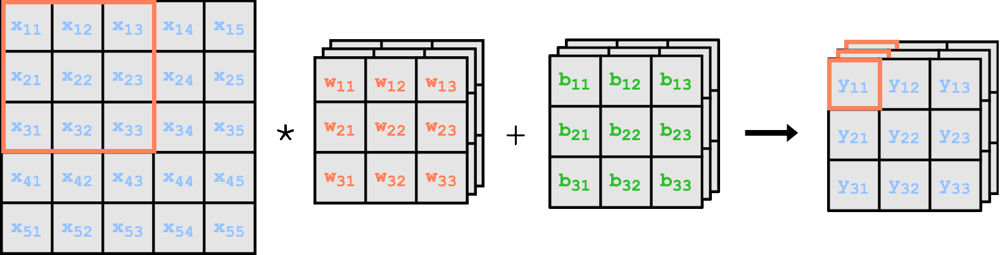

  

<h2>
  Motivation:
</h2>

  It is well known that the structure of Convolutional Neural Networks (CNNs) is strongly inspired by observations of the brain's visual cortex. Various studies have provided evidence that layer structures and cross-correlation are effective implementations for modeling biological image processing. Over time, numerous experiments have been conducted to find the optimal network structure for different tasks. 

  This framework allows for the variation of network composition at all levels. You can modify hyperparameters and structure, as well as the mathematical foundations. The focus is on the ability to vary kernel shapes and locations in subsequent layers.

  

<h2>
Installation:
</h2>

  This Framework is completly written on Python. For installation I recommend pip with following command:

<pre><code>
pip install scrambledConvolution@git+https://github.com/tillvogt/scrambledConvolution.git
</code></pre>

<h2>
Jupyter Notebook:
</h2>

  For testing with a prewritten Democase I provided the scrambledConvolution_demo.ipynb. Feel free to play around with it. Especially the particularities of the Convolutional layer are demonstrated.

